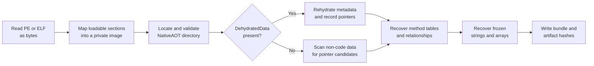

# How AOTregano recovery works

This page describes the recovery pipeline at an analyst-friendly level. The
important idea is that AOTregano emulates a small amount of loader work on a
private byte array. It never transfers control to the sample.

## Minimal NativeAOT background

The normal .NET execution model uses a runtime, metadata, and usually IL that is
compiled as the program runs. NativeAOT instead compiles the application to
native machine code ahead of time. The result looks much more like an ordinary
native PE or ELF and may not be useful to a traditional .NET decompiler.

The executable still needs runtime bookkeeping. A **method table** is one of
those structures. Despite its name, it describes a type as well as its virtual
method slots. It can contain:

- flags identifying the broad runtime element type, such as class, interface,
  value type, or array;
- the base object size;
- a pointer to a related type, commonly a base type or array element type;
- virtual method pointers;
- pointers to implemented interface method tables.

NativeAOT can also store some metadata in a compact **dehydrated** form. The
runtime expands, or rehydrates, it before using it. AOTregano reproduces that
transformation statically so later recovery sees the layout that would have
existed in memory.

## Pipeline

### 1. Parse and map the executable

AOTregano first checks the on-disk input limit, reads the file, and parses only
the executable-container fields it needs.

For PE files it requires PE32+ and machine type AMD64. For ELF files it requires
little-endian ELF64 and machine type x86-64. Section bounds, sizes, and table
ranges are validated before use.

It then creates a zero-initialized byte array representing the image's virtual
address space and copies file-backed section bytes into their mapped positions.
This is similar to a loader's section mapping, but it is only data manipulation:
no page is made executable and no entry point is called.

The original sample is never patched. All later changes happen in this private
mapped image, which eventually becomes `mapped-image.bin`.

### 2. Locate the NativeAOT section directory

The preferred path searches initialized, non-executable sections for the `RTR`
ReadyToRun signature. A candidate is accepted only if its header and directory
are structurally valid:

- the section count is within a bounded range;
- the directory entry format is supported;
- every non-zero range stays inside the mapped image;
- sizes and end addresses do not overflow.

The implementation understands legacy 24-byte directory entries and the
16-byte size/start form used by newer NativeAOT images. If several valid headers
exist, candidates containing `DehydratedData` and `FrozenObjectRegion` are
preferred.

#### Removed `RTR` header

Some protectors or post-processors remove the four-byte signature or complete
header while leaving the section directory. AOTregano has a conservative
fallback for this case. It scans initialized, non-executable data for ordered,
24-byte NativeAOT directory entries and requires corroborating structure.

When dehydrated metadata exists, its destination must match either a zero-raw
section with a name containing `hydrat`, or a validated original `hydrated`
linker contribution merged into a larger section. Without dehydrated metadata,
the frozen-object region must already be fully file-backed. These checks reduce
false recognition of arbitrary 24-byte records as a NativeAOT directory.

The manifest identifies the path taken as `readyToRunHeader` or
`orphanedSectionDirectory`.

### 3. Rehydrate metadata or scan pointers

If a non-empty `DehydratedData` region is present, AOTregano decodes all six
currently supported command families:

| Command | Effect in the private mapped image |
| --- | --- |
| Copy | Copy literal bytes from the command stream. |
| Zero fill | Append zero bytes. |
| Relative-pointer relocation | Resolve a fixup and write a 32-bit relative pointer. |
| Pointer relocation | Resolve a fixup and write a 64-bit absolute pointer. |
| Inline relative-pointer relocation | Resolve inline targets and write 32-bit relative pointers. |
| Inline pointer relocation | Resolve inline targets and write 64-bit absolute pointers. |

Every read, destination, relocation, and output size is bounds checked. Absolute
pointer locations produced during hydration become the seed set for method-table
recovery. If the command stream is malformed or writes outside the mapped image,
analysis stops with `hydrationFailed`; AOTregano does not silently continue with
partially reconstructed metadata.

If no dehydrated region exists, hydration is reported as `notRequired`.
AOTregano instead scans 8-byte-aligned values in non-executable sections and
records values that point back inside the mapped image. These are candidates,
not claims that every value is a real pointer.

### 4. Recover method tables

AOTregano uses structural constraints to identify `System.Object`, the root of
the managed type hierarchy. It requires exactly one candidate matching the
expected layout and code-pointer pattern. Starting there, it follows related-type
and interface pointers, parses newly discovered method tables, and repeats until
no more tables can be added.

ReadyToRun versions select the expected `net70` or `net80` method-table layout.
When the header is missing, AOTregano tries both and accepts a layout only when
the structure validates.

`System.String` is inferred only when exactly one recovered class directly
related to `System.Object` has the expected base size. All other names are
synthetic and include the broad element type plus the method-table address, for
example `Class_00007FF712345000`. A synthetic name is a stable analysis identity;
it is not an original namespace or class name.

### 5. Recover frozen objects

NativeAOT can place pre-created managed objects in a `FrozenObjectRegion`.
AOTregano walks pointer candidates in that region and recovers an object only
when its method-table pointer was already validated.

For strings it validates a bounded UTF-16 length and a trailing null, then emits
the address, length, value, and a sanitized synthetic name. For arrays it
currently recovers one-dimensional, zero-based array metadata: address, element
count, related element-type identity, and synthetic name. Array contents are not
decoded into the JSONL output.

Recovery is deliberately conservative. Counts should be treated as a validated
subset, not a guarantee that every runtime type or frozen object was found.

### 6. Write the recovery bundle

Bundle files are written through temporary files and then moved into place. The
manifest includes a byte length and SHA-256 for every data artifact except
`analysis.json` itself, whose self-hash would be circular. The mapped-image hash
therefore also provides a way to prove which reconstructed byte image was used
for downstream analysis.

See the [output reference](output-reference.md) for file layouts and field
meanings.

## Safety properties and limits

- The input is opened only for byte reads.
- The sample is never passed to `Assembly.Load` or an equivalent loader.
- The entry point and recovered function pointers are never invoked.
- Named libraries are not resolved or loaded.
- Input and mapped-image allocations have independent configurable limits.
- Malformed ranges and arithmetic overflow cause rejection.

Those properties reduce execution risk, but they do not make the artifacts
trusted. A parser bug is still possible, and recovered text or paths remain
attacker-controlled data. Use the same isolation and evidence-handling practices
you would use for the original sample.

## What cannot be recovered

AOTregano cannot recreate data that NativeAOT compilation or later processing
discarded. In particular, it does not restore:

- original IL;
- PDBs or native symbols;
- source code;
- original managed type and member names in the general case;
- complete high-level control flow;
- array payloads as typed JSON values;
- metadata hidden behind an unsupported packer, architecture, or runtime layout.

Use a native disassembler for machine-code analysis and treat AOTregano's
addresses, vtables, strings, and type relationships as additional navigation
and triage evidence.
